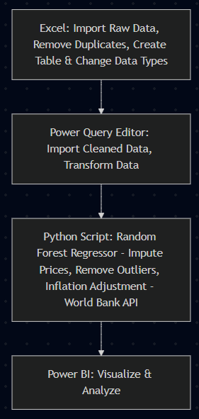

# 🚀 Maven Return to Space Challenge – Power BI Dashboard

## Overview

This project is part of the https://mavenanalytics.io/challenges/maven-return-to-space-challenge.
The goal is to create a single-page Power BI dashboard that answers one of the following Big Space Questions or a compelling question of our own:

The Ultimate Rocket Ranking: Which rocket (by name, cost, or size) is the true champion of space?
The Golden Era of Space: Which decade had the highest success rate, most launches, or best cost efficiency?
The Winning Team: Which country or organization has dominated the space race, and what does their strategy look like?

## Objective

Piece together the history of space travel and uncover fascinating trends through data visualization and analysis.

## Tech Stack

Excel: Data cleaning (remove duplicates, create table, change data types)
Power BI: Data import, transformation, dashboard creation
Python: Advanced preprocessing (Random Forest imputation, inflation adjustment)
Git: Version control

## Workflow

 

## Data Cleaning & Transformation Details

Missing Price Data: Imputed using Random Forest Regressor (see script)
Outliers in Price: Identified via IQR, treated as missing
Time Format Issues: Time column removed
Success Rate Bias: Bayesian adjustment for rockets with few launches
Era Bias: Segment analysis by era (1950s, 1960s, etc.)
Duplicate Records: Removed in Excel
Price Comparability Across Time: Inflation adjustment using World Bank API

## DAX Formulas & Calculations

### Golden Era of Space

Calculates key metrics for each decade, including launch count, success count, success rate, and average adjusted price. Normalizes these metrics for fair comparison.

```
GoldenEraSpace =
VAR SummaryTable =
    ADDCOLUMNS(
        SUMMARIZE(
            space_mission,
            space_mission[Decade]
        ),
        "Launch Count",
            CALCULATE(
                COUNT(space_mission[Mission]),
                FILTER(space_mission, space_mission[Decade] = EARLIER(space_mission[Decade]))
            ),
        "Success Count",
            CALCULATE(
                COUNT(space_mission[MissionStatus]),
                space_mission[MissionStatus] = "Success",
                FILTER(space_mission, space_mission[Decade] = EARLIER(space_mission[Decade]))
            ),
        "Success Rate",
            DIVIDE(
                CALCULATE(
                    COUNT(space_mission[MissionStatus]),
                    space_mission[MissionStatus] = "Success",
                    FILTER(space_mission, space_mission[Decade] = EARLIER(space_mission[Decade]))
                ),
                CALCULATE(
                    COUNT(space_mission[Mission]),
                    FILTER(space_mission, space_mission[Decade] = EARLIER(space_mission[Decade]))
                )
            ),
        "Avg Adjusted Price",
            CALCULATE(
                AVERAGE(space_mission[Adjusted Price]),
                FILTER(space_mission, space_mission[Decade] = EARLIER(space_mission[Decade]))
            )
    )

VAR MaxLaunchCount = MAXX(SummaryTable, [Launch Count])
VAR MaxSuccessCount = MAXX(SummaryTable, [Success Count])
VAR MinAvgAdjPrice = MINX(SummaryTable, [Avg Adjusted Price])

RETURN
    ADDCOLUMNS(
        SummaryTable,
        "Normalized Launch Count", DIVIDE([Launch Count], MaxLaunchCount),
         "Normalized Success Count", DIVIDE([Success Count], MaxSuccessCount),
        "Normalized Avg Adjusted Price", DIVIDE(MinAvgAdjPrice, [Avg Adjusted Price])
    )

```

### Ultimate Rocket Ranking

Ranks rockets by launch count, average adjusted price, and success rate, with normalization for fair comparison.

```
Ultimate Rocket Ranking =
VAR SummaryTable= FILTER(
    SUMMARIZE(
        space_mission,
        space_mission[Rocket],
        "Launch Count", COUNT(space_mission[Rocket]),
        "Avg Adjusted Price", AVERAGE(space_mission[Adjusted Price]),
        "Success Count", CALCULATE(COUNT(space_mission[MissionStatus]), space_mission[MissionStatus] = "Success"),
        "Success Rate", DIVIDE(
            CALCULATE(COUNT(space_mission[MissionStatus]), space_mission[MissionStatus] = "Success"),
            COUNT(space_mission[Mission])
        )
    ),
    [Success Count] > 0
)
VAR MaxLaunchCount = MAXX(SummaryTable, [Launch Count])
VAR MaxSuccessCount = MAXX(SummaryTable, [Success Count])
VAR MinAvgAdjPrice = MINX(SummaryTable, [Avg Adjusted Price])

RETURN
    ADDCOLUMNS(
        SummaryTable,
        "Normalized Launch Count", DIVIDE([Launch Count], MaxLaunchCount),
         "Normalized Success Count", DIVIDE([Success Count], MaxSuccessCount),
        "Normalized Avg Adjusted Price", DIVIDE(MinAvgAdjPrice, [Avg Adjusted Price])
    )

```

### Winning Team Ranking

Evaluates countries and organizations by launch count, success rate (Bayesian estimate), and cost efficiency, then combines these into a final score for ranking.

```
Winning Team Ranking =
VAR SummaryTable =
    SUMMARIZE(
        space_mission,
        space_mission[Company],
        space_mission[Country],
        "Launch Count", COUNT(space_mission[Mission]),
        "Success Count", CALCULATE(
            COUNT(space_mission[MissionStatus]),
            space_mission[MissionStatus] = "Success"
        ),
        "Avg Adjusted Price", AVERAGE(space_mission[Adjusted Price])
    )
VAR MaxLaunchCount = MAXX(SummaryTable, [Launch Count])
VAR MinAvgAdjPrice = MINX(SummaryTable, [Avg Adjusted Price])

RETURN
    ADDCOLUMNS(
        SummaryTable,
        "Bayesian Estimate", DIVIDE([Success Count] + 1, [Launch Count] + 2),
        "Normalized Launch Count", DIVIDE([Launch Count], MaxLaunchCount),
        "Normalized Avg Adjusted Price", DIVIDE(MinAvgAdjPrice, [Avg Adjusted Price]),
        "Final Score",
            0.3 * DIVIDE([Success Count] + 1, [Launch Count] + 2) +
            0.3 * DIVIDE([Launch Count], MaxLaunchCount) +
            0.3 * DIVIDE(MinAvgAdjPrice, [Avg Adjusted Price])
    )
```
